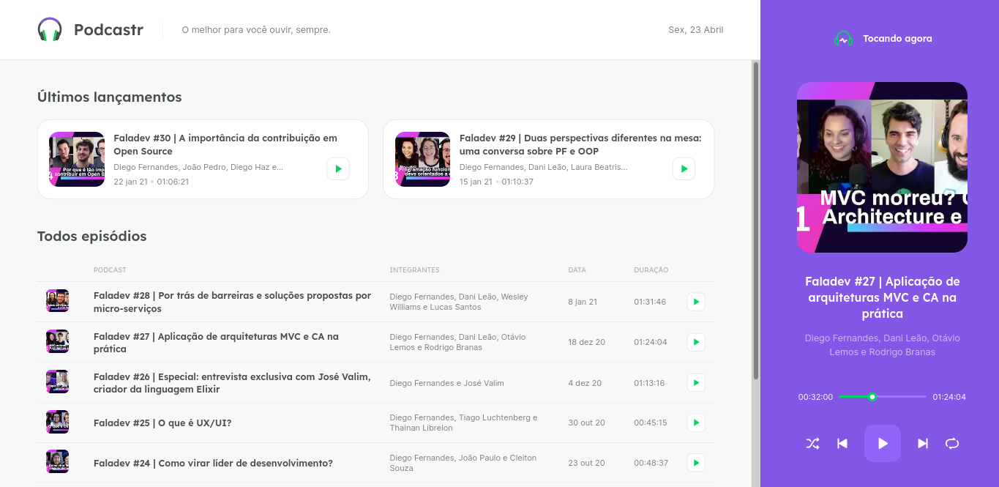

<p align="center">
    
</p>

</br>

## 🔖 Sobre
<b>Podcastr</b> é uma plataforma de podcasts! O projeto frontend foi desenvolvido durante a NLW#05 [RocketSeat](https://rocketseat.com.br/), na trilha ReactJS. Nessa versão, já é possível ouvir alguns episódios e obter as respectivas informações.

</br>

## 📷 Preview
<p align="center">
    
</p>

</br>

## 🚀 Tecnologias utilizadas

-  [ReactJS](https://reactjs.org/)
-  [Typescript](https://www.npmjs.com/package/@types/react)
-  [Axios](https://github.com/axios/axios)
-  [Next.js](https://nextjs.org/)
-  [Sass](https://sass-lang.com/documentation)
-  [json-server](https://github.com/typicode/json-server)

</br>

## 🗂 Como baixar e iniciar o projeto

```bash
# Abra um terminal e copie este repositório com o comando
$ git clone https://github.com/carlos-mattos/podcastr.git
# ou use a opção de download.

# Entre na pasta podcastr
$ cd podcastr

# Instale as dependências
$ npm install

# Inicie o React
$ npm start
```
</br>

## 📝 Licença

Este projeto esta sobe a licença MIT. Veja a [LICENÇA](https://opensource.org/licenses/MIT) para saber mais.

Desenvolvido por [Carlos Eduardo](https://www.linkedin.com/in/carlos-eduardo-andrade-de-mattos-a060b1182/) 🤓
